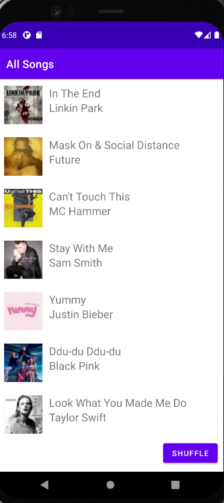
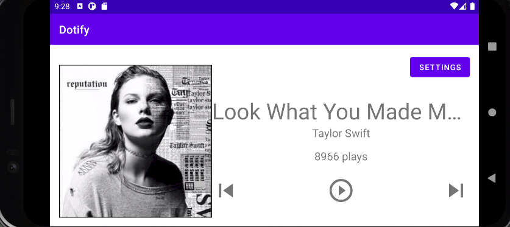

# Dotify Homework 4 - Kevin Chou
This is a ripoff Spotify application to help practice different elements of Kotlin and Android app dev

## Extra Credit Attempted:
In requirement 2.b.v.2, tapping the notification should launch PlayerActivity
that passes the song data to the activity to show the song in the player

## Pic of it Working

